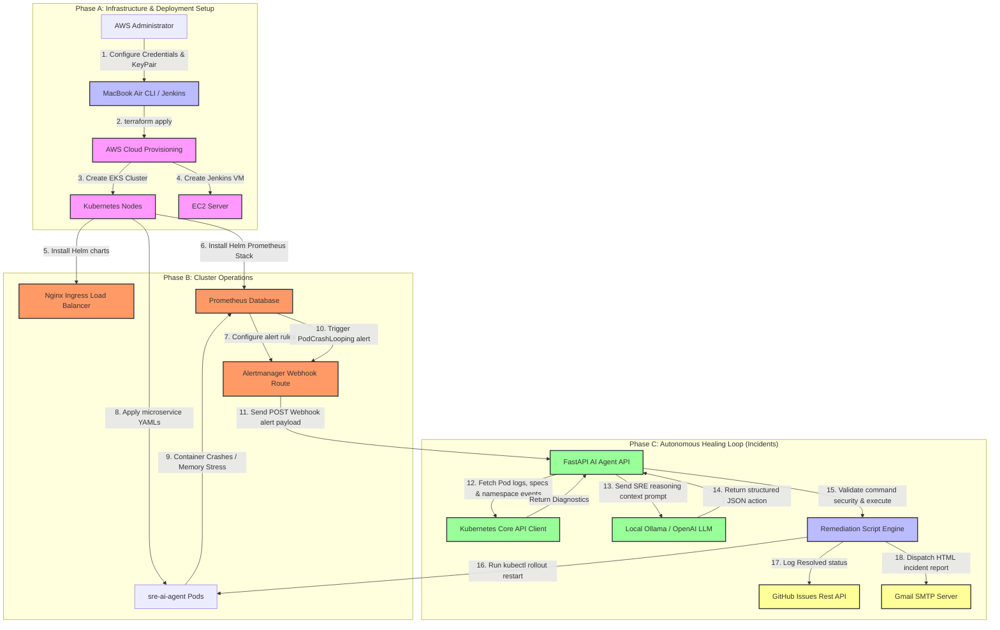

# Project Architecture Flow & Tech Stack Definitions

This document provides a highly visual **Mermaid Flowchart** illustrating the end-to-end autonomous healing lifecycle, followed by comprehensive **Definitions** of each DevOps and AI tool implemented in this project stack.

---

## 📊 1. End-to-End System Architecture Flowchart

Below is the complete interactive flowchart of the AI Ops self-healing platform. It details both the **Infrastructure Deployment Flow** (top down) and the **Autonomous Incident Healing Loop** (circular feedback loop).

Below are two ways to view the flowchart: a **Universal Text Diagram** (which renders perfectly in any Markdown preview window without any plugins) followed by a **Mermaid Flowchart** (for rich-text environments like GitHub).

### 1. Universal Architecture Flowchart (Text Preview)
```text
┌────────────────────────────────────────────────────────────────────────┐
│               PHASE A: INFRASTRUCTURE & DEPLOYMENT SETUP               │
└───────────────────────────────────┬────────────────────────────────────┘
                                    │
                                    ▼
       ┌──────────────────┐   Terraform   ┌──────────────────────────┐
       │   Mac / CLI      ├──────────────►│   AWS Cloud Environment  │
       │   Workspace      │    Deploy     │   (VPC Network, EC2)     │
       └──────────────────┘               └────────────┬─────────────┘
                                                       │
                                                       ▼
                                          ┌──────────────────────────┐
                                          │   AWS EKS Cluster        │
                                          │   (Kubernetes Nodes)     │
                                          └────────────┬─────────────┘
                                                       │
┌──────────────────────────────────────────────────────┼──────────────────────────────────────────────────────┐
│            PHASE B: OPERATIONS                       │             PHASE C: AUTONOMOUS SRE LOOP             │
└──────────────────────────────────────────────────────┼──────────────────────────────────────────────────────┘
                                                       │
                                                       ▼
                                          ┌──────────────────────────┐
                                          │  sre-ai-agent Pod        │
                                          └────────────┬─────────────┘
                                                       │
                                                       ▼  [POD CRASHES!]
                                          ┌──────────────────────────┐
                                          │  Prometheus Database     │
                                          └────────────┬─────────────┘
                                                       │
                                                       ▼  [Fires Alarm]
                                          ┌──────────────────────────┐
                                          │  Alertmanager Webhook    │
                                          └────────────┬─────────────┘
                                                       │
                                                       ▼  [POST Webhook Payload]
  ┌───────────────────────┐  Fetch Specs  ┌──────────────────────────┐  Run Secure  ┌───────────────────────┐
  │  Kubernetes API       │◄──────────────┤     FastAPI AI Agent     ├─────────────►│  Remediation Engine   │
  │  Client               │  Logs/Events  │     Webhook Server       │  Execution   │  (Safe Bash Whitelist)│
  └───────────────────────┘               └────────────┬─────────────┘              └───────────┬───────────┘
                                                       │                                        │
                                                       ▼  [SRE Prompts]                         ▼ [rollout restart]
                                          ┌──────────────────────────┐              ┌───────────────────────┐
                                          │  Ollama / OpenAI         │              │   sre-ai-agent        │
                                          │  (qwen2.5-coder LLM)     │              │   is healed!          │
                                          └────────────┬─────────────┘              └───────────────────────┘
                                                       │
                                                       ▼ [Auto Logs]
                                      ┌──────────────────────────────────┐
                                      │ GitHub Issues & Gmail SMTP Email │
                                      └──────────────────────────────────┘
```

---

### 2. Interactive Flowchart (Mermaid)



---

## 🎯 2. Project Purpose: What problem does this solve?

In traditional IT organizations, **incidents (outages, crashes, resource pressure) represent huge cost, operational overhead, and business risk.** 
When a service crashes:
1. **Detection Delay**: A customer complains or an internal alarm goes off.
2. **On-Call Fatigue**: An SRE/DevOps engineer is paged (often waking them up in the middle of the night).
3. **Manual Analysis**: The engineer spends 10–30 minutes running commands (`kubectl logs`, `kubectl describe`, checking Grafana charts) to discover the root cause.
4. **Remediation latency**: The engineer runs a fix (like scaling or restarting) manually, typing commands that could introduce typos or human errors.
5. **Incident Fatigue**: The engineer must write an incident post-mortem report and update tickets.

### How this project solves it (AI Ops):
By combining **Infrastructure-as-Code**, **Kubernetes Orchestration**, **Prometheus Monitoring**, and **Private Generative AI (Ollama)**, this project builds an **autonomous operations loop** that completes this entire cycle in **under 30 seconds with zero human intervention!** It keeps human SREs fully informed by logging everything to GitHub and emailing clean incident summaries, making production infrastructure highly resilient, self-healing, and cost-effective.

---

## 🛠️ 3. Tech Stack: Tools & Definitions

Here is a complete dictionary of each tool implemented in this project and what role it plays:

### ☁️ Infrastructure & Cloud Layer
* **AWS (Amazon Web Services)**: The global cloud hosting platform where all EKS virtual nodes, networks, and Jenkins build servers reside.
* **AWS EKS (Elastic Kubernetes Service)**: A managed EKS orchestrator that hosts, routes, and scales our containerized microservice pods.
* **AWS EC2 (Elastic Compute Cloud)**: Provides resizable virtual servers in the cloud. In this project, an EC2 host runs your Jenkins CI/CD Build Server.
* **AWS IAM (Identity and Access Management)**: Controls secure API authorization. We configure IAM Roles so the EKS control plane can safely create networks and node hosts on AWS.
* **AWS VPC (Virtual Private Cloud)**: A private, isolated network space inside AWS. We segment it into public subnets (for Jenkins/Load Balancers) and private subnets (for EKS nodes) for high network security.
* **Terraform (IaC)**: Infrastructure-as-Code tool that writes cloud resources in text files. Instead of clicking around the AWS console, running `terraform apply` builds your entire VPC, EKS, and EC2 hosts automatically and consistently from scratch.

### ☸️ Kubernetes & Networking Layer
* **Kubernetes (K8s)**: An open-source orchestrator designed to deploy, scale, and manage containerized software.
* **Helm (Kubernetes Package Manager)**: Basically an "App Store" for Kubernetes. It lets you download and install complex pre-packaged stacks (like Nginx Ingress and Prometheus Operator) in a single terminal command.
* **Nginx Ingress Controller**: A Kubernetes load-balancer that routes external internet traffic into EKS, mapping hostname routes (like `agent.example.com`) to internal service IPs.
* **Kubernetes Namespaces**: Logical partitions inside the cluster to isolate workloads. We use `ingress-nginx` for load-balancer routing, and `production` for the microservices and monitoring stack.
* **HPA (Horizontal Pod Autoscaler)**: A Kubernetes controller that automatically scales the replica count of your pods up or down based on metrics like CPU utilization.

### 📊 Monitoring & SRE Alerting Layer
* **Prometheus**: A time-series database and metric monitoring engine. It scrapes CPU, memory, and container status metrics from your pods every few seconds.
* **Grafana**: A visualization dashboard tool. It connects to Prometheus to render beautiful, real-time graphs showing EKS memory loads, pod crash counters, and system health.
* **Alertmanager**: A routing engine for Prometheus alerts. When our rules (like `PodCrashLooping`) fire, Alertmanager intercepts the alert and dispatches a JSON POST payload to our SRE AI Agent's API endpoint.

### 🤖 AI Ops & Code Integration Layer
* **Python FastAPI**: A modern, high-performance web framework. Our AI SRE Agent runs as a FastAPI API endpoint to catch incoming Alertmanager webhook events in real-time.
* **Ollama**: A lightweight local inference engine that lets you run large language models (like `qwen2.5-coder`) entirely for free on your MacBook Air without sharing data or requiring cloud API keys.
* **LLM Reasoner (qwen2.5-coder)**: A state-of-the-art coding and reasoning AI model. It takes pod logs, events, and specs, diagnoses the root cause, and returns a structured JSON commanding the safe bash fix.
* **Remediation Engine**: A custom Python controller that validates the AI's suggested command against a secure whitelist (preventing terminal injection attacks) and runs the bash script.
* **GitHub REST API (Reporter)**: Automatically opens structured issue tickets inside your GitHub portfolio repository, acting as your automated incident tracker.
* **SMTP (Simple Mail Transfer Protocol)**: A standard email protocol. The agent uses Gmail's secure SMTP APIs to email beautiful HTML post-mortems directly to your inbox.
